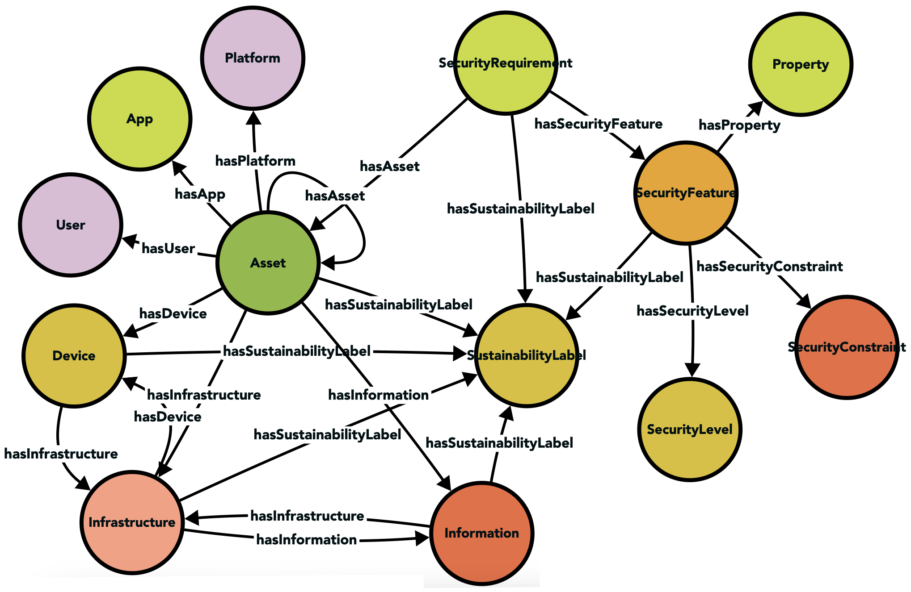
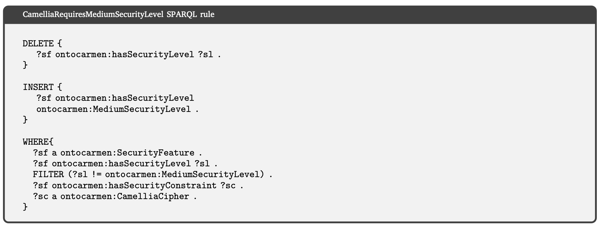
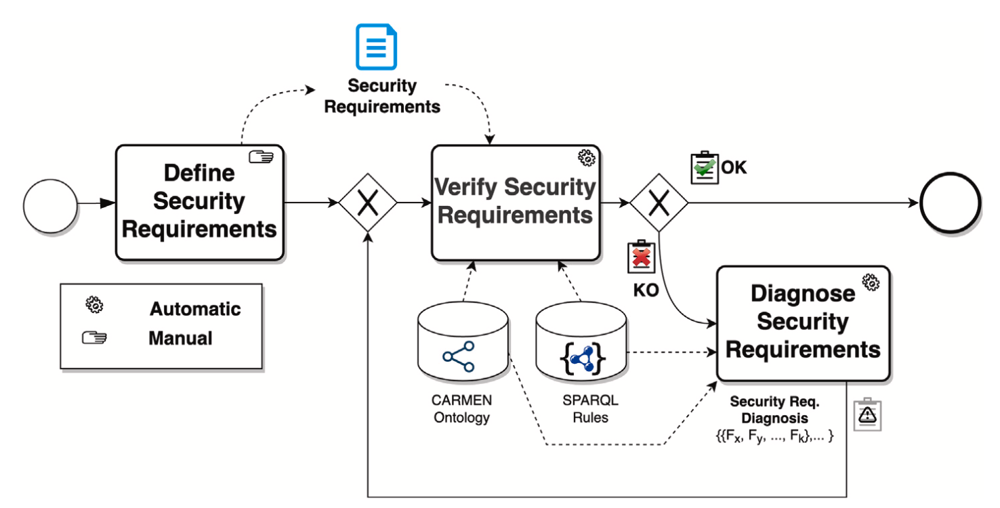
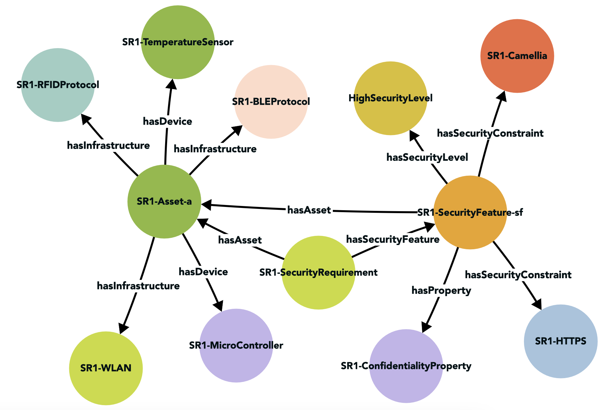
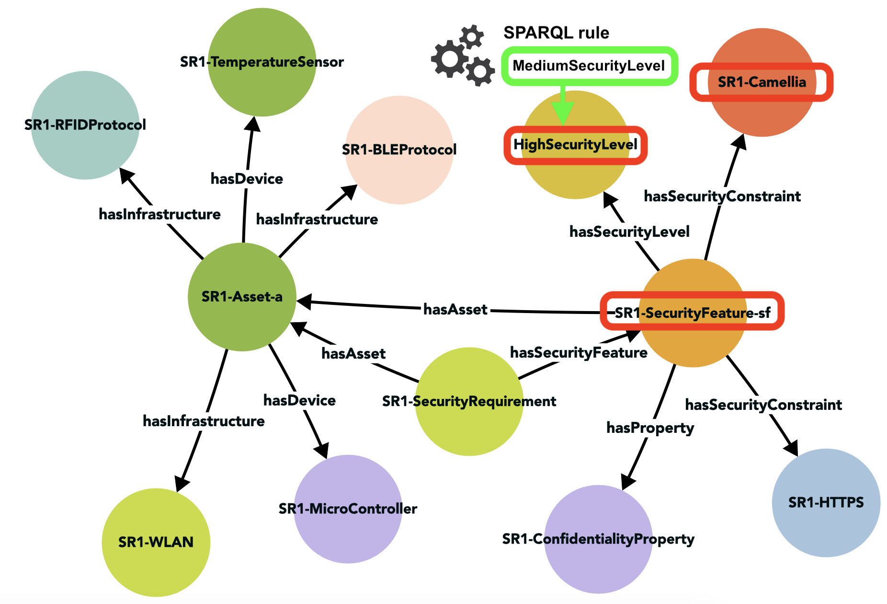

# OntoCarmen

Onto-CARMEN is a proposal designed as an ontology-based approach for the metamodeling and reasoning of Cyber-Physical Systems (CPS) security requirements.

## Files

- **Ontology**: [owl file](Ontology/OntoCarmen.owx).
- Rules: [some SPARQL rules](Ontology/Queries%20SPARQL.md).

- **IoT journal article**: [pdf](/Papers/IoT%20202023%20-%20OntoCarmen.pdf)
- Conference paper in JISBD: [pdf](/Papers/JISBD%202023%20-%20OntoCarmen.pdf)
- Previous article CARMEN with the metamodel and feature model on which the ontology is based: [pdf](/Papers/CI%20202021%20-%2020Carmen.pdf)

## Components

It consists of:

### Ontology

Provides a framework for defining and classifying CPS security requirements. It uses OWL (Web Ontology Language) to formally represent the elements and their relationships. This ontology includes classes such as "Security Requirement", "Asset", "Security Feature", and properties to connect these elements. In addition, it includes axioms to impose constraints and logical rules.

### Reasoning Framework

Use SPARQL rules to verify and diagnose safety requirements at design time. These rules allow to evaluate whether the security requirements are valid and, if not, to provide corrective actions.

Example of a SPARQL rule used to ensure that all security features using Camellia encryption are assigned a medium security level. If a security feature using Camellia has a different security level, the rule will update it to "MediumSecurityLevel".

## Workflow 

We can see a schematic of the process:

Initially, it is necessary to describe the security requirements involving the Cyber-Physical System (CPS) components and security aspects. For this purpose, a semantic model for CPS security requirements is formalized. The ontology allows the creation of individuals as new instances of security requirements.

Validation of these requirements is then performed through semantic rules, identifying the validity of the requirement as valid (OK) or invalid (KO). In the case of an invalid security requirement, the semantic rules allow a diagnosis providing corrective actions to transform it into valid.

## Example 

We see an example with the definition of a security requirement (SR1).

The requirement states that the wireless communication between the temperature sensor and the microcontroller must be encrypted to maintain a high level of confidentiality. To achieve this, we have defined the Confidentiality property, which is associated with a specific type of encryption (Camellia) and a secure communication channel (HTTPS). This security feature is applied to a set of assets including the temperature sensor and the Arduino, which communicate with each other over a WLAN network using BLE or RFID. This relationship between the safety feature and the set of assets is called secure communication.

We show how the SPARQL rule discussed above is applied to the SR1 security requirement, detecting an invalid situation (since it presents a high security level) and how, after applying the rule, the security level has been changed to medium.

