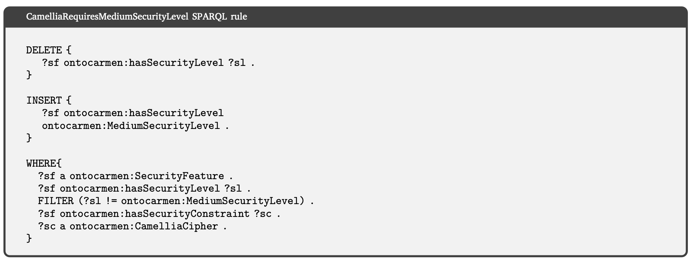
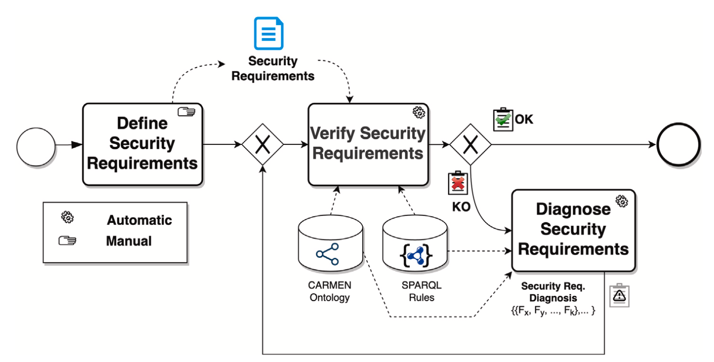
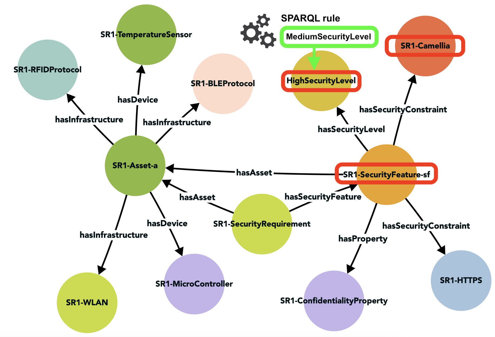

# OntoCarmen

Onto-CARMEN es una propuesta diseñada como un enfoque basado en ontologías para el metamodelado y razonamiento de los requisitos de seguridad de los Sistemas Ciberfísicos (CPS).

## Ficheros

- Ontología: [fichero owl](Ontologia/OntoCarmen.owx)
- Reglas: [algunas reglas SPARQL](Ontologia/Queries%20SPARQL.md)

- Artículo de revista en IoT journal: [pdf](/Papers/IoT%202023%20-%20OntoCarmen.pdf)
- Artículo de congreso en JISBD: [pdf](/Papers/JISBD%202023%20-%20OntoCarmen.pdf)
- Artículo previo CARMEN con el metamodelo y modelo de características en el que se basa la ontología: [pdf](/Papers/CI%202021%20-%20Carmen.pdf)

## Componentes

Se compone de:

### Ontología

Proporciona un marco para definir y clasificar los requisitos de seguridad de los CPS. Utiliza OWL (Web Ontology Language) para representar formalmente los elementos y sus relaciones. Esta ontología incluye clases como "Requisito de Seguridad", "Activo", "Característica de Seguridad", y propiedades para conectar estos elementos. Además, incluye axiomas para imponer restricciones y reglas lógicas.

### Marco de Razonamiento

Usa reglas SPARQL para verificar y diagnosticar los requisitos de seguridad en tiempo de diseño. Estas reglas permiten evaluar si los requisitos de seguridad son válidos y, en caso de no serlo, proporcionar acciones correctivas.

Ejemplo de regla SPARQL que se utiliza para asegurar que todas las características de seguridad que utilizan el cifrado Camellia tengan asignado un nivel de seguridad medio. Si una característica de seguridad que utiliza Camellia tiene un nivel de seguridad diferente, la regla lo actualizará a "MediumSecurityLevel".

## Flujo de trabajo 

Podemos ver un esquema del proceso:

Inicialmente, es necesario describir los requisitos de seguridad que involucran los componentes del Sistema Ciberfísico (CPS) y los aspectos de seguridad. Para ello, se formaliza un modelo semántico para los requisitos de seguridad de los CPS. La ontología permite la creación de individuos como nuevas instancias de requisitos de seguridad.

A continuación se realiza la validación de estos requisitos a través de reglas semánticas, identificando la validez del requisito como válidos (OK) o no válidos (KO). En el caso de un requisito de seguridad inválido, las reglas semánticas permiten un diagnóstico proporcionando acciones correctivas para transformarlo en válido.

## Ejemplo 

Vemos un ejemplo con la definición de un requisito de seguridad (SR1).

El requisito establece que la comunicación inalámbrica entre el sensor de temperatura y el microcontrolador debe cifrarse para mantener un alto nivel de confidencialidad. Para lograrlo, hemos definido la propiedad de Confidencialidad, que está asociada a un tipo específico de cifrado (Camellia) y a un canal de comunicación seguro (HTTPS). Esta característica de seguridad se aplica a un conjunto de activos que incluye el sensor de temperatura y el Arduino, que se comunican entre sí a través de una red WLAN utilizando BLE o RFID. Esta relación entre la característica de seguridad y el conjunto de activos se denomina comunicación segura.

Mostramos cómo la regla SPARQL comentada anteriormente se aplica al requisito de seguridad SR1, detectando una situación no válida (ya que presenta un nivel de seguridad alto) y cómo, tras aplicar la regla, el nivel de seguridad se ha modificado a medio.

